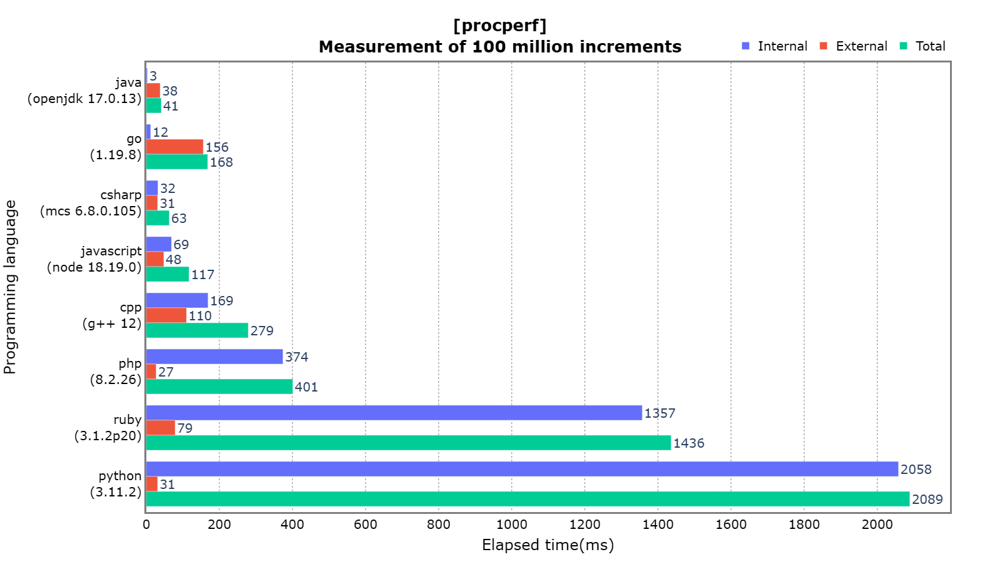

# perfait
Performance survey comparison tool

## Concept
Visualization of multiple measurement results

### Measurement of 100 million increments


## What is possible
### procperf
1. Measuring execution time for each programming language
2. Image output of data in pivot table format

## Reason for development
- I wanted to visualize the differences in processing speed of each programming language

## Versions

|Version|Summary|
|:--|:--|
|0.1.0|Release perfait|

## Installation
### [perfait](https://pypi.org/project/perfait/)
`pip install perfait`

## Usage
### procperf

```json
{
  "Tick": {
    "Dtick": 200,
    "Format": "d"
  },
  "LayoutTitleText": "<b>[procperf]<br>Measurement of 100 million increments</b>",
  "XTitleText": "Elapsed time(ms)",
  "YTitleText": "Programming language",
  "Array": [
    [
      "",
      "Internal",
      "External",
      "Total"
    ],
    [
      "java<br>(openjdk 17.0.13)",
      2,
      36,
      39
    ],
    [
      "go<br>(1.19.8)",
      14,
      221,
      235
    ],
    [
      "csharp<br>(mcs 6.8.0.105)",
      37,
      18,
      56
    ],
    [
      "javascript<br>(node 18.19.0)",
      69,
      86,
      156
    ],
    [
      "cpp<br>(g++ 12)",
      167,
      4,
      172
    ],
    [
      "php<br>(8.2.26)",
      375,
      298,
      673
    ],
    [
      "python<br>(3.11.2)",
      1161,
      67,
      1228
    ],
    [
      "ruby<br>(3.1.2p20)",
      3251,
      491,
      3742
    ]
  ]
}
```

## CLI
### init
Setting up the execution time measurement code

#### 1. Initialize by running CLI
```
init
```
`perfait init`
```
perfait_scripts\perfait\go.mod is done.
perfait_scripts\perfait\perfait.cs is done.
perfait_scripts\perfait\perfait.go is done.
perfait_scripts\perfait\perfait.hpp is done.
perfait_scripts\perfait\perfait.java is done.
perfait_scripts\perfait\perfait.js is done.
perfait_scripts\perfait\perfait.php is done.
perfait_scripts\perfait\perfait.py is done.
perfait_scripts\perfait\perfait.rb is done.
```

### image.write
Output measurement data as an image

#### 1. Image(PNG) conversion by CLI execution
```
image.write # <perfait file path> <image file path>
```
`perfait image.write perfait.json perfait.png`
```
perfait.png is done.
```
